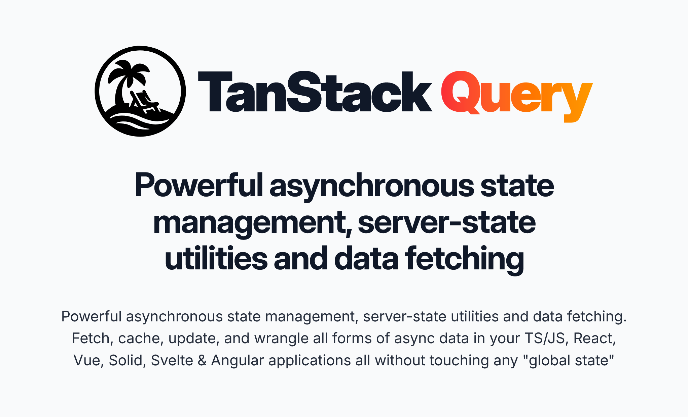

  

A data‑fetching library built to simplify fetching, caching, synchronizing, and updating server state.

- Protocol‑agnostic fetching (REST, GraphQL, promises, etc.)
- Caching, refetching, pagination & infinite scroll
- Mutations, dependent queries & background updates
- Prefetching, cancellation & React Suspense support

<a href="https://tanstack.com/query" style="font-weight: bold">Read the Query Docs →</a>
 

 

  

[Become a Sponsor!](https://github.com/sponsors/tannerlinsley/)

## Get Involved

- We welcome issues and pull requests!
- Participate in [GitHub discussions](https://github.com/TanStack/query/discussions)
- Chat with the community on [Discord](https://discord.com/invite/WrRKjPJ)
- See [CONTRIBUTING.md](./CONTRIBUTING.md) for setup instructions

## Partners

<a href="https://www.speakeasy.com/product/react-query?utm_source=tanstack&utm_campaign=tanstack">
  <picture>
    <source
      srcset="https://tanstack.com/assets/speakeasy-dark-BjP-Hd9M.svg"
      media="(prefers-color-scheme: dark)"
    />
    <source
      srcset="https://tanstack.com/assets/speakeasy-light-UpY7QmwQ.svg"
      media="(prefers-color-scheme: light)"
    />
    <!-- fallback -->
    
  </picture>
</a>

## Explore the TanStack Ecosystem

<a href="https://github.com/tanstack/config" style="font-weight: bold;">TanStack Config</a> – Tooling for JS/TS packages  
  <a href="https://github.com/tanstack/db" style="font-weight: bold;">TanStack DB</a> – Reactive sync client store  
  <a href="https://github.com/tanstack/devtools" style="font-weight: bold;">TanStack DevTools</a> – Unified devtools panel  
  <a href="https://github.com/tanstack/form" style="font-weight: bold;">TanStack Form</a> – Type‑safe form state  
  <a href="https://github.com/tanstack/pacer" style="font-weight: bold;">TanStack Pacer</a> – Debouncing, throttling, batching  
  <a href="https://github.com/tanstack/ranger" style="font-weight: bold;">TanStack Ranger</a> – Range & slider primitives  
  <a href="https://github.com/tanstack/router" style="font-weight: bold;">TanStack Router</a> –  Type‑safe routing, caching & URL state 
  <a href="https://github.com/tanstack/router" style="font-weight: bold;">TanStack Start</a> –  Full‑stack SSR & streaming 
  <a href="https://github.com/tanstack/store" style="font-weight: bold;">TanStack Store</a> – Reactive data store  
  <a href="https://github.com/tanstack/table" style="font-weight: bold;">TanStack Table</a> – Headless datagrids  
  <a href="https://github.com/tanstack/virtual" style="font-weight: bold;">TanStack Virtual</a> – Virtualized rendering  
  … and more at <a href="https://tanstack.com" style="font-weight: bold;">TanStack.com »</a>

<!-- Use the force, Luke -->
